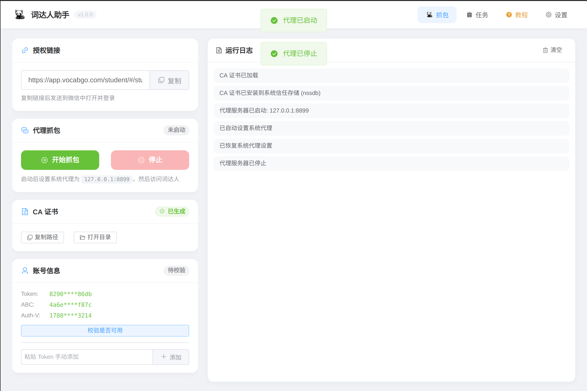
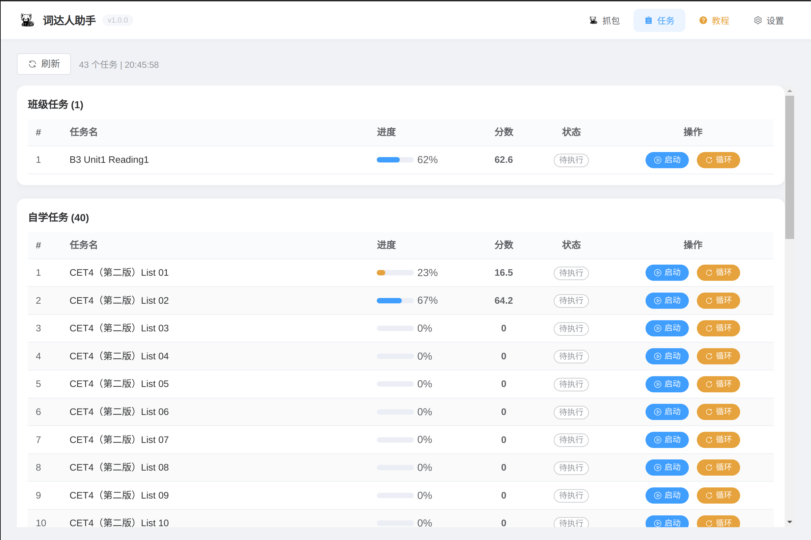
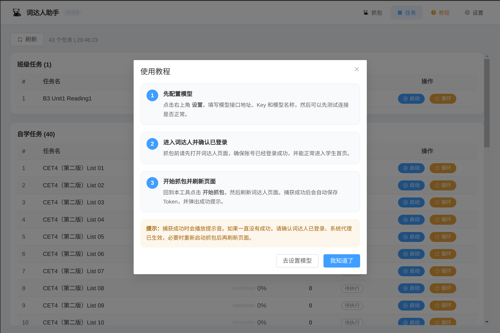
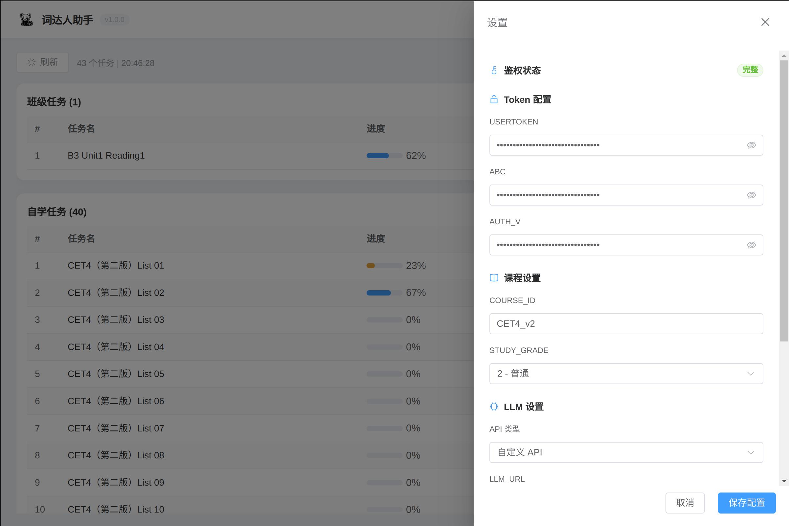
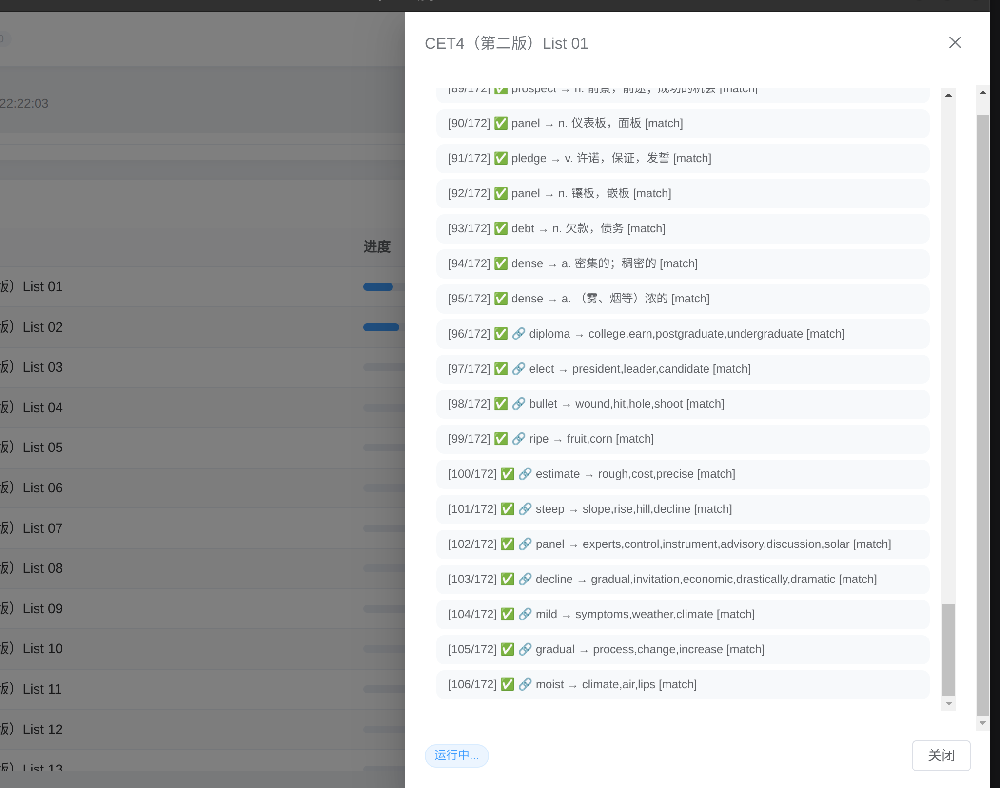
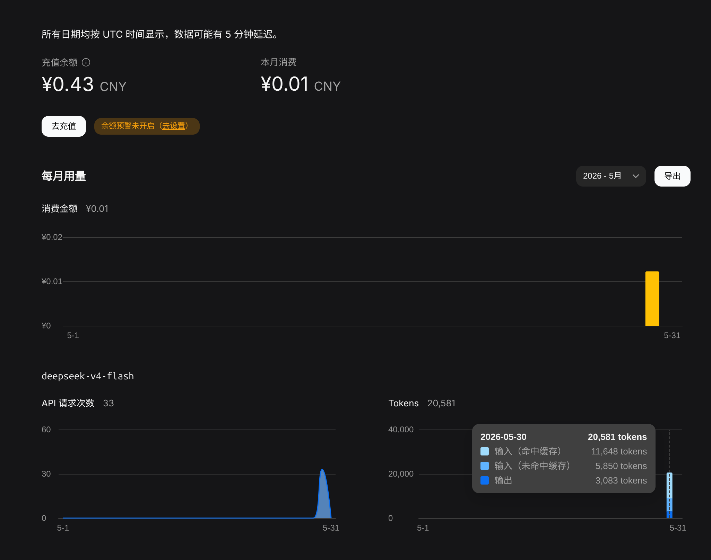

# 词达人助手

一个基于 **Electron + Vue 3** 的词达人桌面助手，提供抓包获取鉴权信息、任务列表读取、自动任务执行、题库缓存、LLM 辅助判断、运行日志和系统托盘状态展示等功能。

> 本项目涉及第三方平台接口、账号鉴权信息和本地代理抓包功能。请仅在合法授权的账号和环境中使用，并自行遵守相关平台规则。

## 项目截图









## 主要功能

- 抓包获取词达人鉴权信息：`USERTOKEN`、`ABC`、`AUTH_V`
- 配置自定义模型 API 或轨迹流动 API
- 支持班级任务和自学任务
- 支持题库缓存、LLM 辅助判断和运行日志
- LLM 限速时自动暂停等待，不盲猜提交
- Token 可用性校验，不可用时红色提示
- 系统托盘显示运行任务、进度和最近日志
- 内置点击音效和成功提示音

## 下载安装

如果只是使用软件，不需要自己构建，可以直接到项目的 Releases 页面下载打包好的程序。

下载地址：

```text
https://github.com/YYY887/cidaren/releases/tag/1.0.1
```

Windows 推荐下载：

```text
词达人助手-1.0.0-win-x64.exe
```

Linux 如果已发布 deb 包，则下载对应的 `.deb` 文件。

## 使用教程

### 1. 配置模型

打开应用后，点击右上角 **设置**。

在 **LLM 设置** 中选择 API 类型：

- **自定义 API**：填写 `LLM_URL`、`LLM_MODEL`、`LLM_KEY`
- **轨迹流动 API**：接口地址自动使用 `https://api.siliconflow.cn/v1`，只需要填写模型名和 Key
- **DeepSeek 官方 API**：接口地址自动使用 `https://api.deepseek.com`，只需要填写模型名和 Key。推荐使用 `deepseek-v4-flash`，速度快、成本低，约 200 次请求 0.01 元。

DeepSeek 推荐路由参考：





配置完成后可以点击 **测试模型连通性**。

### 2. 抓包获取 Token

进入 **抓包** 页面，按下面顺序操作：

1. 先打开词达人页面，确认账号已经登录成功。
2. 回到本工具，点击 **开始抓包**。
3. 刷新词达人页面。
4. 捕获成功后会自动保存 Token，并播放成功提示音。

如果账号信息显示红色，说明鉴权信息不完整或不可用，可以点击 **校验是否可用** 重新检查。

### 3. 启动任务

进入 **任务** 页面，加载任务列表后选择需要执行的班级任务或自学任务。

运行时可以查看：

- 当前任务状态
- 答题日志
- 任务完成情况
- 托盘中的任务进度

### 4. 托盘使用

关闭窗口不会退出应用，而是最小化到系统托盘。

托盘菜单会显示：

- 正在运行的任务数量
- 任务名称
- 当前轮次
- 当前进度
- 最近一条日志

托盘菜单也提供 **显示窗口**、**刷新任务状态** 和 **退出**。

## 开发命令

安装依赖：

```bash
npm install
```

开发运行：

```bash
npm run dev
```

构建：

```bash
npm run build
```

测试：

```bash
npm test
```

打包：

```bash
npm run package:win
npm run package:linux
npm run package:mac
```

> 在 Linux 上交叉打 Windows 安装包通常需要安装 `wine`。

## 项目结构简述

```text
src/main/       Electron 主进程、任务管理、抓包、接口客户端
src/preload/    安全 IPC 桥接
src/renderer/   Vue 前端界面
img/            README 截图
release/        打包产物
build/          打包图标资源
```

## 注意事项

- 抓包功能会启动本地代理，并可能生成/安装 CA 证书。
- 本地代理可能影响系统网络，异常退出后请检查系统代理设置。
- LLM 接口可能限速，程序会自动等待重试。
- 请勿将自己的 Token、API Key 等敏感信息提交到公开仓库。

## 免责声明

本项目仅用于学习、研究和个人自动化实践。请勿用于违反平台规则、影响他人权益或未经授权的场景。使用本项目造成的账号、数据或网络风险由使用者自行承担。

## Star 统计

<a href="https://star-history.com/#YYY887/cidaren&Date">
  <picture>
    <source
      media="(prefers-color-scheme: dark)"
      srcset="https://api.star-history.com/svg?repos=YYY887/cidaren&type=Date&theme=dark"
    />
    <source
      media="(prefers-color-scheme: light)"
      srcset="https://api.star-history.com/svg?repos=YYY887/cidaren&type=Date"
    />
    
  </picture>
</a>
